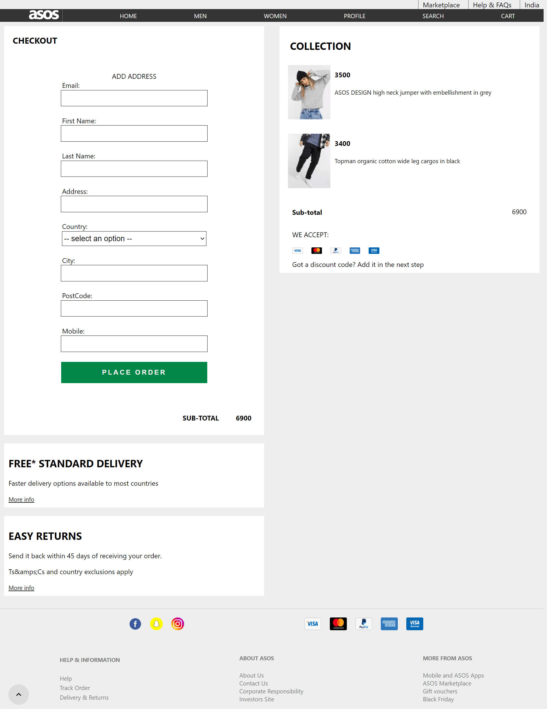

# asos

### An Effort into making a pixel perfect fullstack shopping website inspired By Asos.com

  Asos is an online fashion website, offers great services to is customer. Customer can explore various products and can buy them with a successful payment. Reachers can also send feedback message to the provider.
 

## Tech Stack used:

<code></code>
<code></code>
<code></code>
<code></code>
<code></code>
<code></code>
<code></code>
<code></code>
<code></code>

### Installation and Setup Instructions

Clone this repository.
You will need node and npm installed globally on your machine.
Installation: npm install To install dependencies
Run:npm run dev to run the App
App runs on port 3000
Server runs on port 5555

## <code>Sneak Peak</code>

## <code>Product Page</code>

## <code>Cart Page</code>

## <code>Checkout Page</code>

## <code>Profile Page</code>

## Tech Library used:

  <ul>
  <li>React APP</li>
  <li>Axios</li>
  <li>Material UI</li>
<li>bcrypt</li>
<li>bcryptjs</li>
<li>concurrently</li>
<li>cors</li>
<li>dotenv</li>
<li>express</li>
<li>joi</li>
<li>jsonwebtoken</li>
<li>mongoose</li>
  <li>nodemailer</li>
<li>razorpay</li>
<li>react-router-dom</li>
<li>request</li>
<li>uuid</li>
    <li>email-validator</li>
    <li>react</li>
    <li>react-dom</li>
    <li>react-redux</li>
    <li>react-router-dom</li>
    <li>react-scripts</li>
    <li>redux</li>
    <li>redux-devtools-extension</li>
    <li>redux-thunk</li>
    <li>styled-components</li>
  </ul>
  
# <a href="https://asos-client.netlify.app/" > Demo </a>

## Contributors

<h3>Shamsher Ali</h3>👨‍- <a href="https://github.com/syedshamsher" >Shamsher</a>
<h4>I take all the responsiblity for every single line of code.</h4>
